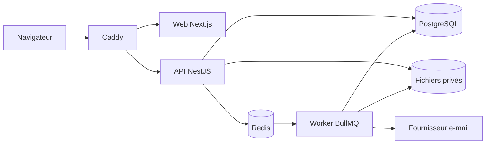
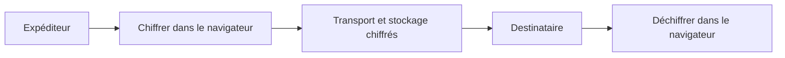
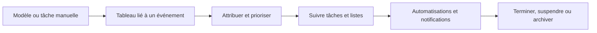

[English](README.md) | Français

[](#présentation)
[](LICENSE)


# PE Community

PE Community est un espace de travail auto-hébergé destiné à la gestion d'une communauté privée. Il réunit l'administration des membres, les événements, les annonces, les tableaux de tâches, les automatisations, les notifications, les journaux d'audit et les discussions chiffrées entre participants dans une application bilingue.


## Présentation

Le projet propose des espaces distincts pour les propriétaires, les administrateurs et les membres au sein d'une plateforme communautaire commune. Il est distribué sous la forme d'une pile Docker Compose construite depuis les sources et comprend un site bilingue de présentation et de documentation opérationnelle.

## Fonctionnalités

- Espaces pour propriétaires, administrateurs et membres, contrôlés par rôles
- Annuaire des membres, profils, inscriptions, annonces et fil d'actualité
- Événements, calendrier, réponses, tableaux de tâches et automatisations
- Envoi d'e-mails, modèles, notifications opérationnelles et journaux d'audit
- Discussions directes et de groupe avec chiffrement côté navigateur et pièces jointes chiffrées
- Interfaces et documentation en anglais et en français
- Configuration initiale guidée de la communauté et du compte propriétaire

## Architecture

Le trafic du navigateur entre par la passerelle Caddy de même origine. Caddy achemine les pages de l'application vers Next.js et les requêtes API, de téléversement et Socket.IO vers NestJS. L'API utilise PostgreSQL, Redis et un stockage privé pour les fichiers ; les workers BullMQ traitent les tâches en file d'attente et transmettent les e-mails au fournisseur configuré.



Le monorepo contient également un site Next.js distinct pour la présentation publique et la documentation opérationnelle. Il ne fait pas partie du chemin des requêtes de l'application authentifiée présenté ci-dessus.

## Chat Integré

## Des conversations privées et sécurisées au cœur de la communauté

Discussion est l'espace de communication intégré de PE Community pour la collaboration quotidienne entre membres et équipes. Les participants passent naturellement des conversations individuelles privées aux conversations de groupe, échangent en temps réel des messages et pièces jointes chiffrés, suivent les éléments non lus et organisent les échanges importants sans quitter la plateforme. La sauvegarde chiffrée des clés facilite également la récupération de l'historique pris en charge lors d'un changement de navigateur ou d'appareil.


### Pensé pour les échanges quotidiens

| Fonctionnalité | Ce qu'elle apporte |
| --- | --- |
| Conversations individuelles et de groupe | Des échanges privés entre deux personnes et des espaces communs pour les équipes, projets ou groupes de la communauté. |
| Interaction en temps réel | Messages instantanés, indicateurs de saisie, réactions, mises à jour de livraison et reconnexion automatique dès le retour de la connexion. |
| Messages et fichiers chiffrés | Chiffrement côté navigateur du texte, des médias, des images et des documents pris en charge avant leur transport et leur stockage habituels. Les conversations individuelles proposent aussi des images à ouverture unique. |
| Organisation des conversations | Compteurs d'éléments non lus, recherche, filtres Toutes / Non lues / Groupes / Favoris et épinglage local pour un accès rapide. |
| Présence et activité | Le statut en ligne et la dernière présence connue permettent de savoir plus facilement quand les autres participants sont disponibles. |
| Récupération sécurisée | Une sauvegarde chiffrée protégée par mot de passe peut restaurer l'historique chiffré concerné sur un autre navigateur ou appareil pris en charge. |

L'espace comprend aussi des actions familières : réponses, réactions, modification des messages, favoris personnels et effacement ou suppression limités à chaque participant. Ces outils facilitent le suivi des conversations actives tout en préservant la confidentialité entre leurs participants.

### Un chiffrement centré sur les participants

PE Community applique un chiffrement de bout en bout côté navigateur au contenu des conversations. Les messages sont chiffrés avant d'entrer dans le transport temps réel ou le stockage serveur habituel, puis les participants concernés les déchiffrent localement dans leur navigateur. Le matériel d'identité privée de discussion reste côté client ; la plateforme traite le contenu chiffré et les informations limitées nécessaires à sa livraison.

Les pièces jointes prises en charge suivent le même principe. Les fichiers sont chiffrés dans le navigateur avant leur envoi, et les informations nécessaires à leur ouverture circulent dans le contenu chiffré de la conversation. Les participants peuvent ainsi partager des médias et des documents sans que des copies ordinaires lisibles soient conservées dans le flux normal des pièces jointes.



> [!NOTE]
> Les clés privées de discussion restent côté client. Comme pour toute application chiffrée exécutée dans un navigateur, la sécurité de la session du navigateur et du code applicatif qui lui est distribué fait partie du modèle global de confiance.

### Changer d'appareil sans perdre son historique chiffré

Les utilisateurs peuvent exporter une sauvegarde chiffrée de leur identité de discussion depuis les contrôles **Clés sécurisées**. Cette sauvegarde est protégée par un mot de passe de récupération utilisé localement et jamais envoyé à PE Community. Son importation sur un autre navigateur ou appareil pris en charge peut rendre de nouveau lisible l'historique chiffré concerné.

La restauration d'une sauvegarde n'accorde pas automatiquement le droit d'envoyer des messages. Le nouveau navigateur ou appareil doit encore être autorisé pour la messagerie chiffrée active. Les clés conservées pour d'anciennes conversations peuvent continuer à déverrouiller localement le contenu historique sans autoriser la création de nouveaux messages.

### Des échanges en temps réel avec un résultat de livraison clair

`Socket.IO` maintient les conversations actives synchronisées et reconnecte la discussion sélectionnée lorsque la connexion revient. PE Community attend l'accusé de réception du serveur avant de considérer un message chiffré comme correctement envoyé, une expiration du délai, une perte de connexion ou un problème d'autorisation produit ainsi une erreur visible plutôt qu'un échec silencieux.

## Tableau de Tâches

## Organisez le travail de la planification à l’exécution

Les tableaux de tâches de PE Community transforment les opérations de la communauté en travail visible et attribuable. Les administrateurs peuvent préparer un événement, le décomposer en tâches concrètes, désigner les responsables, définir les priorités et les échéances, puis suivre l’avancement dans un espace unique. Les membres voient les tableaux et les tâches qui les concernent, tandis que les autorisations réservent les actions administratives aux bonnes personnes.

Un tableau peut être lié à un événement ou créé comme espace de planification autonome. Les tableaux liés à un événement offrent aujourd’hui le parcours de tâches complet : les tâches restent associées à l’événement et leurs mises à jour sont répercutées en temps réel pour les collaborateurs actifs.


### Ce que proposent les tableaux de tâches

| Fonctionnalité | Utilité |
| --- | --- |
| Vue d’ensemble | État de préparation, progression, avancement des listes, charge de travail, collaboration récente et points d’attention |
| Cycle des tâches | Colonnes À faire, En cours et Terminé, avec classement et changement de statut |
| Responsabilités | Plusieurs responsables, visibilité des tâches non attribuées, synthèse de charge et vues adaptées au membre |
| Détails de planification | Priorité faible, moyenne ou haute, étiquettes, descriptions, échéances, listes de contrôle, commentaires et pièces jointes |
| Recherche | Recherche, filtres de visibilité, de liaison et de statut, tri et pagination |
| Cycle du tableau | États actif, en pause et terminé, réouverture et archivage contrôlé |
| Collaboration | Actualisation des tâches en temps réel et historique des changements significatifs |
| Localisation | Interface complète en français et en anglais |

### Modèles de tâches réutilisables

Les modèles sont des schémas opérationnels réutilisables, et non de simples listes de titres. Un modèle contient une suite ordonnée d’éléments avec intitulés, consignes, étiquettes, priorités et décalages d’échéance facultatifs. Les administrateurs peuvent maintenir les modèles actifs, réorganiser leurs éléments et archiver ceux qui ne doivent plus être utilisés.

Lorsqu’un modèle actif est appliqué à un événement, PE Community crée les tâches correspondantes. Les décalages relatifs sont calculés à partir de la date de l’événement. Des consignes comme « confirmer le lieu sept jours avant » ou « envoyer le suivi un jour après » deviennent ainsi reproductibles sans reconstruire le plan. Les réunions, ateliers, campagnes et autres événements récurrents gagnent en cohérence.

### Planification liée aux événements

Un tableau lié à un événement conserve le travail opérationnel auprès de l’événement concerné. Les administrateurs peuvent créer et modifier les tâches, choisir un ou plusieurs responsables, définir priorités et dates, réordonner le travail, tenir les listes de contrôle et ajouter commentaires ou pièces jointes. Les membres peuvent consulter les tableaux liés aux événements, repérer leurs responsabilités et l’urgence, puis changer le statut des tâches qui leur sont attribuées.

Les tableaux publics sont visibles par les membres de la communauté. Un tableau autonome privé devient visible lorsqu’un membre y reçoit une tâche, tandis que les tableaux liés à un événement restent accessibles aux participants authentifiés. Les tableaux autonomes et leur cycle de vie sont disponibles ; l’ajout direct de tâches dans un tableau autonome est volontairement reporté dans la version actuelle.

### Automatisation intégrée au tableau

Une règle d’automatisation associe un déclencheur vérifié à une action ciblée. Les règles actuelles peuvent notifier avant une échéance, signaler un retard, relancer une tâche inactive, repérer une tâche sans responsable, avertir qu’une liste reste incomplète à l’approche de l’échéance, escalader un retard après un délai de grâce ou terminer une tâche lorsque sa liste est entièrement cochée.

Les règles peuvent cibler les responsables et, selon la configuration, les administrateurs. La diffusion prend en charge les notifications dans l’application et le courriel facultatif. Les administrateurs peuvent prévisualiser et appliquer des préréglages, valider une configuration, conserver un brouillon, publier les changements, consulter les versions, restaurer une version antérieure, archiver ou réactiver une règle, examiner sa planification, tester les notifications et consulter les exécutions. Les résultats distinguent succès, exécutions ignorées et échecs ; les simulations et tests facilitent les changements prudents.

### Responsabilités, priorités et progression

La vue d’ensemble transforme le détail des tâches en synthèse opérationnelle. Elle met en évidence les retards et échéances proches, les listes incomplètes, les tâches sans responsable, la progression globale, la charge par personne et les commentaires, pièces jointes ou mises à jour récents. Un administrateur peut ainsi passer directement d’un indicateur de préparation à la tâche qui demande une intervention.

Les membres disposent d’une vue ciblée des tableaux attribués ou visibles, avec le nombre de tableaux attribués et publics ainsi que les tâches proches de l’échéance ou en retard. La recherche et les filtres permettent de cibler l’attribution, la visibilité, le lien à un événement, l’état, le risque, la progression ou l’échéance.



> [!NOTE]
> L’accès aux tableaux et leur gestion suivent les autorisations de la communauté. L’automatisation complète une planification responsable ; elle ne remplace pas la vérification des responsables, des dates, des livraisons et de l’état du tableau.

## Prérequis

Le mode d'auto-hébergement pris en charge nécessite Docker Engine avec Docker Compose v2. Le développement local depuis les sources nécessite également Node.js 22 et pnpm 11.5.2 par l'intermédiaire de Corepack.

## Démarrage Rapide

1. Copiez `.env.example` vers `.env`.
2. Remplacez chaque valeur secrète requise par une valeur indépendante. `openssl rand -hex 32` convient aux secrets de l'application.
3. Définissez `APP_DOMAIN` et `WEB_ORIGIN` avec l'adresse que les membres ouvriront.
4. Construisez et démarrez la pile :

```bash
docker compose -f docker-compose.prod.yml up -d --build
```

Ouvrez `WEB_ORIGIN` et terminez la configuration unique. N'exécutez pas les données de développement pour une communauté réelle.

## Configuration

Le fichier [`.env.example`](.env.example) répertorie les variables prises en charge pour le déploiement public. La documentation opérationnelle bilingue détaillée se trouve dans `apps/site` ; soit le site public.

Traitez les secrets JWT, les poivres de mot de passe, les clés de chiffrement, les identifiants de base de données, les jetons de configuration et de récupération ainsi que les identifiants SMTP comme des secrets de production.

## Configuration Initiale

Sur une installation non configurée, ouvrez l'application et suivez l'assistant pour créer la communauté, ses valeurs par défaut, les réglages e-mail et le compte propriétaire initial. Le point de terminaison de configuration se ferme après la réussite de l'opération.

## Sécurité

Les mots de passe utilisent Argon2id avec un poivre applicatif. Les sessions reposent sur des cookies HTTP-only signés et des enregistrements côté serveur. La plateforme propose également l'authentification multifacteur, les contrôles d'autorisation, la journalisation d'audit, la validation des téléversements, l'accès aux discussions limité aux participants et le chiffrement des discussions côté navigateur.

Le chiffrement des discussions protège le contenu des messages et des pièces jointes contre une lecture serveur ordinaire, mais les métadonnées et la sécurité des points de terminaison restent importantes. Consultez le guide public de sécurité opérationnelle et [SECURITY.md](SECURITY.md) avant d'exposer une installation.

## Documentation

Les guides complets en anglais et en français concernant le produit, l'administration, le déploiement, les sauvegardes, la sécurité et le dépannage sont maintenus dans `apps/site`, soit la [Documentation](https://community.ponaekolo.com/docs).

## Développement

```bash
corepack enable
pnpm install --frozen-lockfile
cp .env.example .env
pnpm dev
```

`pnpm dev` démarre l'API, l'application Web authentifiée, le worker et la surveillance du paquet partagé. Démarrez séparément le site de documentation avec `pnpm site:dev`.

Vérifications courantes :

```bash
pnpm exec prisma validate --schema prisma/schema.prisma
pnpm db:generate
pnpm --filter @pe/api test
pnpm --filter @pe/api build
pnpm --filter @pe/worker test
pnpm --filter @pe/worker build
pnpm --filter @pe/web test
pnpm --filter @pe/web exec tsc --noEmit
pnpm --filter @pe/web build
pnpm --filter @pe/site exec tsc --noEmit
pnpm --filter @pe/site build
```

## Structure du Dépôt

- `apps/api` : API NestJS et serveur Socket.IO
- `apps/web` : application communautaire authentifiée
- `apps/worker` : workers d'e-mails et d'automatisation
- `apps/site` : site public de présentation et de documentation opérationnelle
- `packages/shared` : contrats partagés pour les autorisations, les e-mails et les automatisations
- `prisma` : schéma, migrations et données de développement fictives
- `deploy` : configuration du proxy inverse et tests contractuels de déploiement

## Contribuer

Consultez [CONTRIBUTING.md](CONTRIBUTING.md). Ce document et les politiques communautaires sont actuellement maintenus en anglais. Les problèmes de sécurité doivent suivre [SECURITY.md](SECURITY.md), et non le système public de tickets.

## Signalement de Problèmes de Sécurité

Les vulnérabilités devront être signalées au moyen du signalement privé de vulnérabilités de GitHub. N'ouvrez pas de ticket public. Consultez [SECURITY.md](SECURITY.md) pour connaître la politique de signalement.

## Licence

PE Community est distribué sous la licence GNU Affero General Public License v3.0. Consultez [LICENSE](LICENSE) pour lire l'intégralité des conditions.
