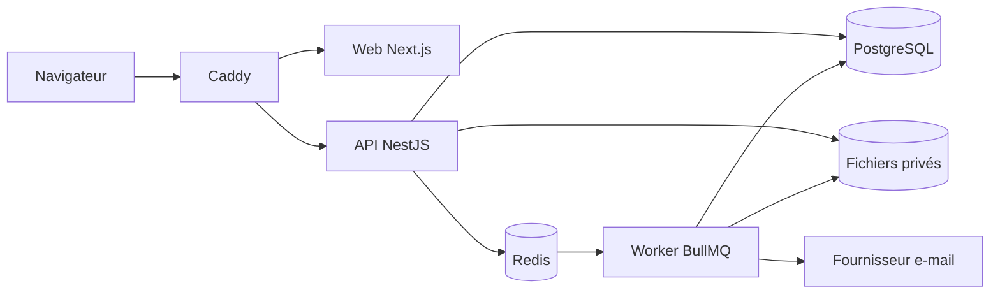

[English](README.md) | Français

[](#présentation)
[](LICENSE)


# PE Community

PE Community est un espace de travail auto-hébergé destiné à la gestion d'une communauté privée. Il réunit l'administration des membres, les événements, les annonces, les tableaux de tâches, les automatisations, les notifications, les journaux d'audit et les discussions chiffrées entre participants dans une application bilingue.


## Présentation

Le projet propose des espaces distincts pour les propriétaires, les administrateurs et les membres au sein d'une plateforme communautaire commune. Il est distribué sous la forme d'une pile Docker Compose construite depuis les sources et comprend un site bilingue de présentation et de documentation opérationnelle.

## Fonctionnalités

- Espaces pour propriétaires, administrateurs et membres, contrôlés par rôles
- Annuaire des membres, profils, inscriptions, annonces et fil d'actualité
- Événements, calendrier, réponses, tableaux de tâches et automatisations
- Envoi d'e-mails, modèles, notifications opérationnelles et journaux d'audit
- Discussions directes et de groupe avec chiffrement côté navigateur et pièces jointes chiffrées
- Interfaces et documentation en anglais et en français
- Configuration initiale guidée de la communauté et du compte propriétaire

## Architecture

Le trafic du navigateur entre par la passerelle Caddy de même origine. Caddy achemine les pages de l'application vers Next.js et les requêtes API, de téléversement et Socket.IO vers NestJS. L'API utilise PostgreSQL, Redis et un stockage privé pour les fichiers ; les workers BullMQ traitent les tâches en file d'attente et transmettent les e-mails au fournisseur configuré.



Le monorepo contient également un site Next.js distinct pour la présentation publique et la documentation opérationnelle. Il ne fait pas partie du chemin des requêtes de l'application authentifiée présenté ci-dessus.

## Prérequis

Le mode d'auto-hébergement pris en charge nécessite Docker Engine avec Docker Compose v2. Le développement local depuis les sources nécessite également Node.js 22 et pnpm 11.5.2 par l'intermédiaire de Corepack.

## Démarrage Rapide

1. Copiez `.env.example` vers `.env`.
2. Remplacez chaque valeur secrète requise par une valeur indépendante. `openssl rand -hex 32` convient aux secrets de l'application.
3. Définissez `APP_DOMAIN` et `WEB_ORIGIN` avec l'adresse que les membres ouvriront.
4. Construisez et démarrez la pile :

```bash
docker compose -f docker-compose.prod.yml up -d --build
```

Ouvrez `WEB_ORIGIN` et terminez la configuration unique. N'exécutez pas les données de développement pour une communauté réelle.

## Configuration

Le fichier [`.env.example`](.env.example) répertorie les variables prises en charge pour le déploiement public. La documentation opérationnelle bilingue détaillée se trouve dans `apps/site` ; soit le site public.

Traitez les secrets JWT, les poivres de mot de passe, les clés de chiffrement, les identifiants de base de données, les jetons de configuration et de récupération ainsi que les identifiants SMTP comme des secrets de production.

## Configuration Initiale

Sur une installation non configurée, ouvrez l'application et suivez l'assistant pour créer la communauté, ses valeurs par défaut, les réglages e-mail et le compte propriétaire initial. Le point de terminaison de configuration se ferme après la réussite de l'opération.

## Sécurité

Les mots de passe utilisent Argon2id avec un poivre applicatif. Les sessions reposent sur des cookies HTTP-only signés et des enregistrements côté serveur. La plateforme propose également l'authentification multifacteur, les contrôles d'autorisation, la journalisation d'audit, la validation des téléversements, l'accès aux discussions limité aux participants et le chiffrement des discussions côté navigateur.

Le chiffrement des discussions protège le contenu des messages et des pièces jointes contre une lecture serveur ordinaire, mais les métadonnées et la sécurité des points de terminaison restent importantes. Consultez le guide public de sécurité opérationnelle et [SECURITY.md](SECURITY.md) avant d'exposer une installation.

## Documentation

Les guides complets en anglais et en français concernant le produit, l'administration, le déploiement, les sauvegardes, la sécurité et le dépannage sont maintenus dans `apps/site`, soit le site public.

## Développement

```bash
corepack enable
pnpm install --frozen-lockfile
cp .env.example .env
pnpm dev
```

`pnpm dev` démarre l'API, l'application Web authentifiée, le worker et la surveillance du paquet partagé. Démarrez séparément le site de documentation avec `pnpm site:dev`.

Vérifications courantes :

```bash
pnpm exec prisma validate --schema prisma/schema.prisma
pnpm db:generate
pnpm --filter @pe/api test
pnpm --filter @pe/api build
pnpm --filter @pe/worker test
pnpm --filter @pe/worker build
pnpm --filter @pe/web test
pnpm --filter @pe/web exec tsc --noEmit
pnpm --filter @pe/web build
pnpm --filter @pe/site exec tsc --noEmit
pnpm --filter @pe/site build
```

## Structure du Dépôt

- `apps/api` : API NestJS et serveur Socket.IO
- `apps/web` : application communautaire authentifiée
- `apps/worker` : workers d'e-mails et d'automatisation
- `apps/site` : site public de présentation et de documentation opérationnelle
- `packages/shared` : contrats partagés pour les autorisations, les e-mails et les automatisations
- `prisma` : schéma, migrations et données de développement fictives
- `deploy` : configuration du proxy inverse et tests contractuels de déploiement

## Contribuer

Consultez [CONTRIBUTING.md](CONTRIBUTING.md). Ce document et les politiques communautaires sont actuellement maintenus en anglais. Les problèmes de sécurité doivent suivre [SECURITY.md](SECURITY.md), et non le système public de tickets.

## Signalement de Problèmes de Sécurité

Les vulnérabilités devront être signalées au moyen du signalement privé de vulnérabilités de GitHub. N'ouvrez pas de ticket public. Consultez [SECURITY.md](SECURITY.md) pour connaître la politique de signalement.

## Licence

PE Community est distribué sous la licence GNU Affero General Public License v3.0. Consultez [LICENSE](LICENSE) pour lire l'intégralité des conditions.
