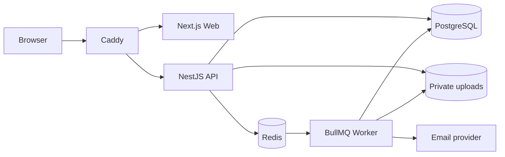

English | [Français](README.fr.md)

[](#overview)
[](LICENSE)


# PE Community

PE Community is a self-hosted workspace for operating a private community. It brings member administration, events, announcements, task boards, automation, notifications, audit logs, and encrypted participant chat into one bilingual application.

## Overview

The project provides separate owner, administrator, and member workspaces over a shared community platform. It is distributed as a source-built Docker Compose stack and includes a bilingual product and operator documentation site.

## Features

- Role-based owner, administrator, and member workspaces
- Member directory, profiles, registrations, announcements, and feed
- Events, calendar, RSVPs, task boards, and task automation
- Email delivery, templates, operational notifications, and audit logs
- Direct and group chat with browser-side encryption and encrypted attachments
- English and French interfaces and documentation
- Guided first-run setup for the initial community and Owner account

## Architecture

Browser traffic enters through Caddy's same-origin edge. Caddy routes application pages to Next.js and API, upload, and Socket.IO requests to NestJS. The API uses PostgreSQL, Redis, and private upload storage; BullMQ workers consume queued work and deliver email through the configured provider.



The monorepo also contains a separate Next.js site for public product and operator documentation. It is not part of the authenticated application request path shown above.

## Requirements

The supported self-hosted path requires Docker Engine with Docker Compose v2. Local source development additionally requires Node.js 22 and pnpm 11.5.2 through Corepack.

## Quick Start

1. Copy `.env.example` to `.env`.
2. Replace every required secret placeholder with an independent value. `openssl rand -hex 32` is suitable for the application secrets.
3. Set `APP_DOMAIN` and `WEB_ORIGIN` to the address members will open.
4. Build and start the stack:

```bash
docker compose -f docker-compose.prod.yml up -d --build
```

Open `WEB_ORIGIN` and complete the one-time setup flow. Do not run the development seed for a real community.

## Configuration

The sanitized [`.env.example`](.env.example) lists the supported public deployment variables. Detailed bilingual operator guidance lives in `apps/site`; run `pnpm site:dev` to browse it locally.

Treat JWT secrets, password peppers, encryption keys, database credentials, setup and recovery tokens, and SMTP credentials as production secrets. Never commit them.

## First-Run Setup

On an unconfigured installation, open the application and follow the guided setup to create the community, defaults, email settings, and initial Owner account. The setup endpoint closes after successful completion.

## Security

Passwords use Argon2id with an application pepper. Sessions use signed HTTP-only cookies with server-side records. The platform also provides MFA, permission checks, audit logging, upload validation, participant-scoped chat access, and browser-side chat encryption.

Encrypted chat protects message and attachment content from normal server-side reading, but metadata and endpoint security still matter. Review the public operator security guide and [SECURITY.md](SECURITY.md) before exposing an installation.

## Documentation

The full English and French product, administration, deployment, backup, security, and troubleshooting guides are maintained in `apps/site`. The repository READMEs remain concise entrypoints rather than duplicating that documentation.

## Development

```bash
corepack enable
pnpm install --frozen-lockfile
cp .env.example .env
pnpm dev
```

`pnpm dev` starts the API, authenticated web application, worker, and shared-package watcher. Start the documentation site separately with `pnpm site:dev`.

Common checks:

```bash
pnpm exec prisma validate --schema prisma/schema.prisma
pnpm db:generate
pnpm --filter @pe/api test
pnpm --filter @pe/api build
pnpm --filter @pe/worker test
pnpm --filter @pe/worker build
pnpm --filter @pe/web test
pnpm --filter @pe/web exec tsc --noEmit
pnpm --filter @pe/web build
pnpm --filter @pe/site exec tsc --noEmit
pnpm --filter @pe/site build
```

## Repository Structure

- `apps/api`: NestJS API and Socket.IO server
- `apps/web`: authenticated community application
- `apps/worker`: email and automation workers
- `apps/site`: public product and operator documentation site
- `packages/shared`: shared permissions, email, and automation contracts
- `prisma`: schema, migrations, and fictional development seed
- `deploy`: reverse-proxy configuration and deployment contract tests

## Contributing

See [CONTRIBUTING.md](CONTRIBUTING.md). Security issues must follow [SECURITY.md](SECURITY.md), not the public issue tracker.

## Security Reporting

Vulnerabilities should be reported through GitHub Private Vulnerability Reporting. Do not open a public issue. See [SECURITY.md](SECURITY.md) for the reporting policy.

## License

PE Community is licensed under the GNU Affero General Public License v3.0. See [LICENSE](LICENSE) for the full terms.
